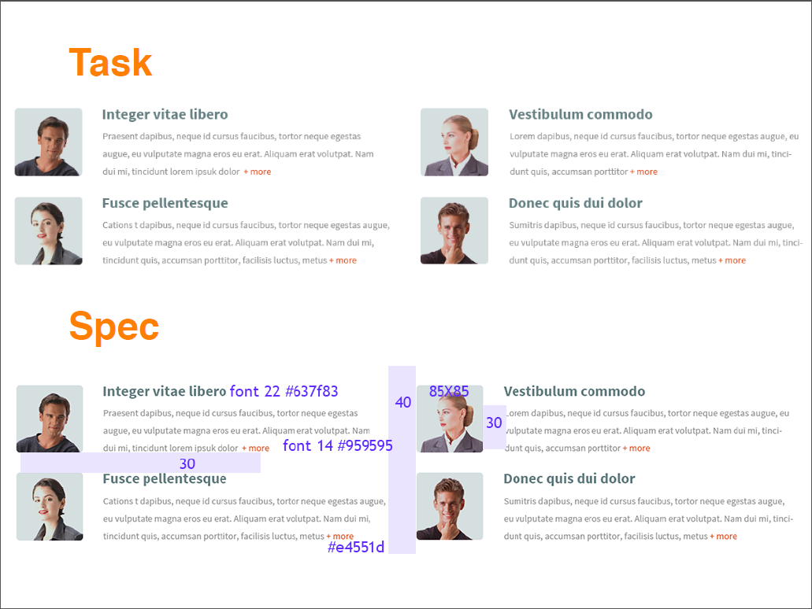

# Lektion9  

**Conditional Comments**  
* [try it](http://codepen.io/puzankov/pen/xGGGRG?editors=100)
* [read it](https://msdn.microsoft.com/en-us/library/ms537512(v=vs.85).aspx)

**-webkit**
* [-webkit-background-clip: text](http://codepen.io/puzankov/pen/rVVVOg?editors=110)
* [cross-fade](http://codepen.io/puzankov/pen/eNNNNX?editors=110)
* [text stroke](http://codepen.io/puzankov/pen/YXXXwp?editors=110)
* [mask-image](http://codepen.io/puzankov/pen/gpppMx?editors=110)
* [gradient mask](http://codepen.io/puzankov/pen/XbbbKv?editors=110)
* [reflect](http://codepen.io/puzankov/pen/vOOOXx?editors=110)

[webkit css props](http://css-infos.net/properties/webkit)  

**Practice**

  
