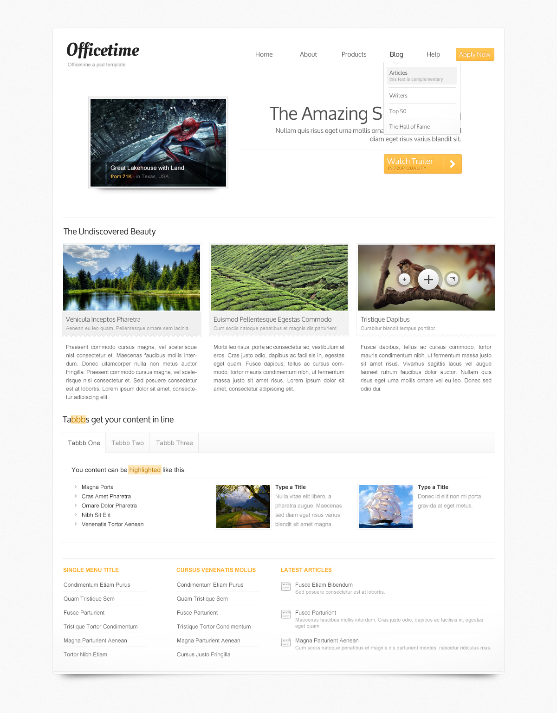
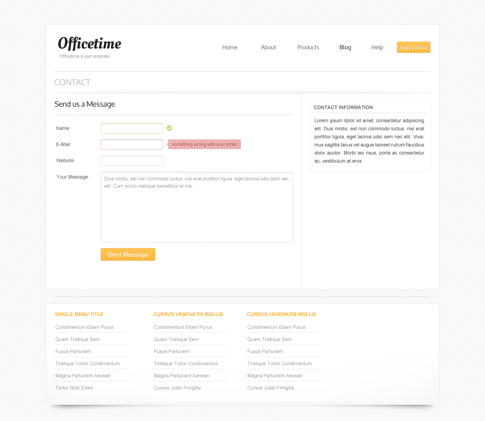

# Экзаменационная работа. Верстка.

Необходимо сверстать сайт по макету **index2.psd**  

## Обязательное задание

## Дополнительное задание

Макет **contact.psd**

###**ТЗ:**
* Верстка статическая, не резиновая. Основной блок центрируется по ширине экрана.  
* В макете есть несколько скрытых слоев. Которые показывают hover state элементов.  
* К сожалению дизайнер не нарисовал hover эффектов для различных элементов (ссылок, кнопок) по-этому эти эффекты клиент просит добавить вас. Дизайн эффектов — на ваше усмотрение.  
* В основном меню есть кнопка Apply now. это не рщмук ыефеу - это статическая кнопка в интерфесе.  
* Иконки необходимо будет сверстать с использованием либо спрайтов либо icon fonts.  
* Закачик поставил следующие требования по браузерам: последние версии Chrome, Yandex, Firefox, Safari.  
* Тексты использовать те, что в макете.  
