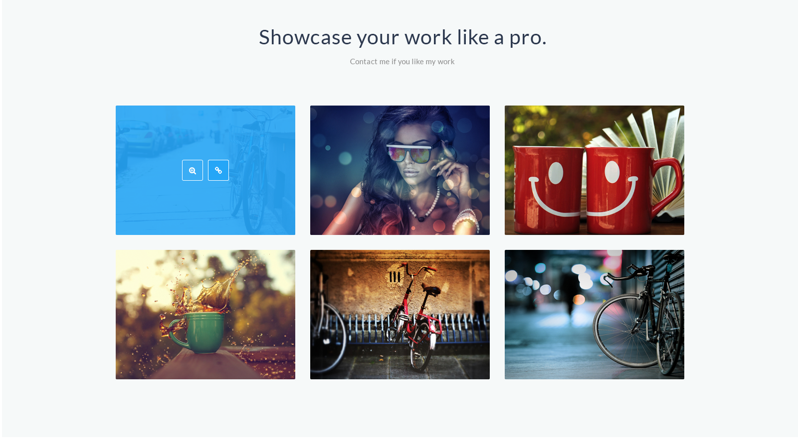

# Lesson 10

[Список кодов состояния HTTP](https://ru.wikipedia.org/wiki/%D0%A1%D0%BF%D0%B8%D1%81%D0%BE%D0%BA_%D0%BA%D0%BE%D0%B4%D0%BE%D0%B2_%D1%81%D0%BE%D1%81%D1%82%D0%BE%D1%8F%D0%BD%D0%B8%D1%8F_HTTP)  
[List of HTTP header fields](https://en.wikipedia.org/wiki/List_of_HTTP_header_fields)  
[HTTP cookie](https://en.wikipedia.org/wiki/HTTP_cookie#Secure_and_HttpOnly)  
[Top 7 Myths about HTTPS ](http://blog.httpwatch.com/2011/01/28/top-7-myths-about-https/)  

### Задание 1

**Необходимо сверстать блок из макета: lesson10.psd**

ТЗ:
 
* блок должен быть адаптивным: при сужении окна в строке дложно оставаться 2 потом 1 блок. 
  
* при расширении окна, максимально в строке должно оставаться только 3 блока с фото.
  
* синяя подложка появляется на блоке по hover'у на него.
  
* на полдожке есть 2 кнопки. hover для кнопока прорисован в макете
  
* шрифт для заголовка 'Lato'
  
* слой в котором увеличенная фотография пока не верстаем

