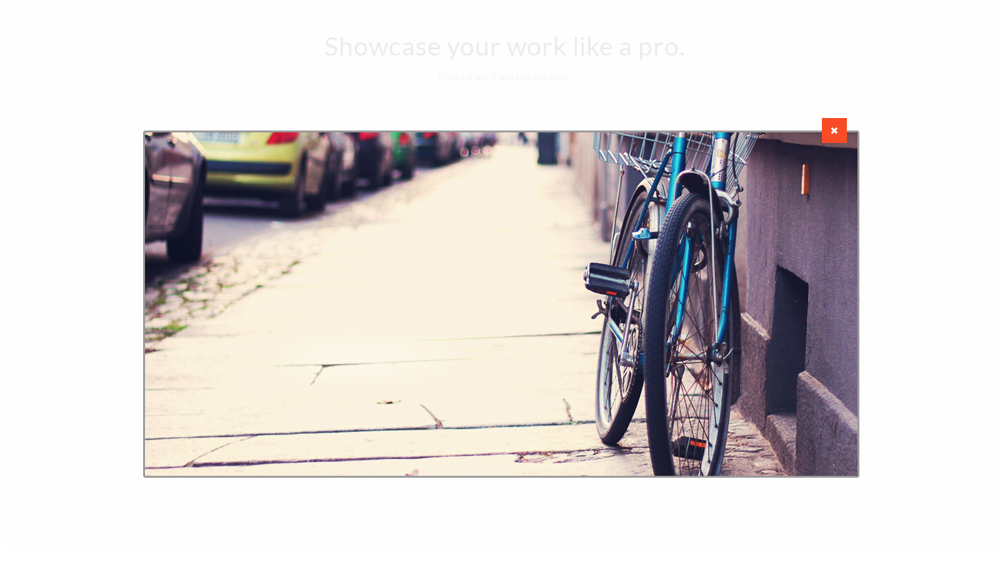

# Lesson 11

### Ссылки  

**“How browsers work” Tali Garsiel**  
<https://www.html5rocks.com/en/tutorials/internals/howbrowserswork/>

**Принципы работы современных веб-браузеров**  
<https://www.html5rocks.com/ru/tutorials/internals/howbrowserswork/>

**CSS свойство z-index**  
<http://resources.webknowledge.ru/digests/css/property/z-index/>

**How Browsers Lay Out Web Pages**  
<https://dbaron.org/talks/2012-03-11-sxsw/master.xhtml>

### Задание 1  

**Необходимо доверстать блок из макета: lesson10.psd**  

ТЗ:  
•	продолжаем доделывать макет из 10-го урока  
•	верстаем слой, в котором увеличенная фотография  
•	показывается на доступную ширину родительского блока  
•	если знания JS хватает можно сделать открытие увеличенной фото по клику на кнопку лупы  
•	если знаний JS не хватает - просто делаем блок и отдельный класс для него, который будет показывать блок, а при удалении этого класса - блок скрывается.  

